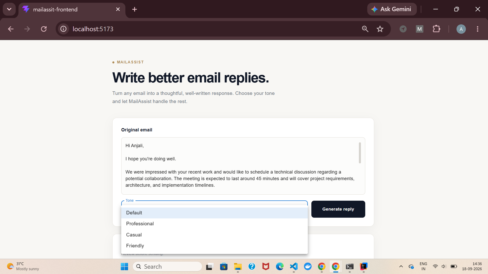
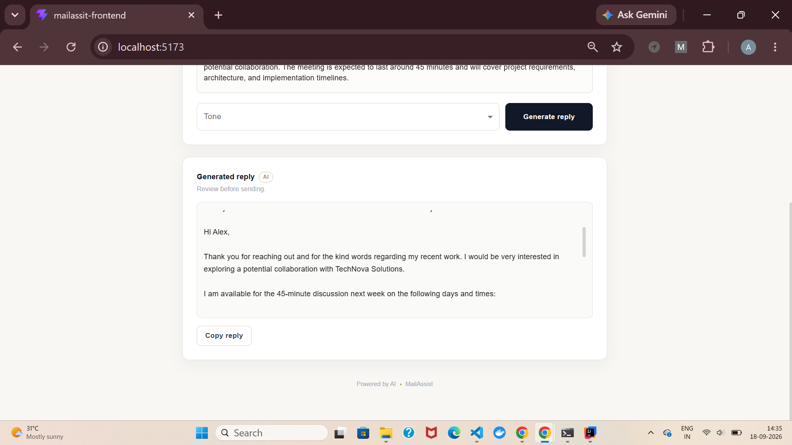
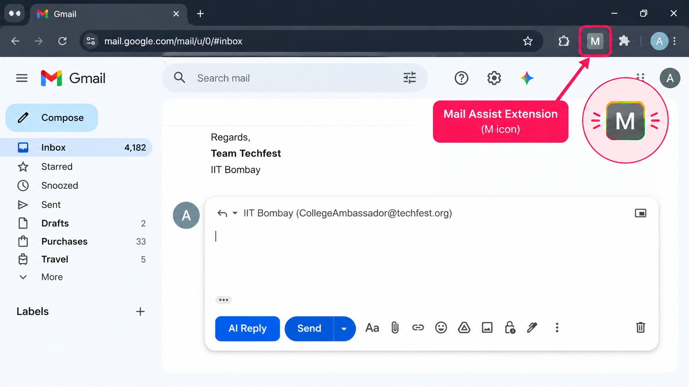

Mail Assist

An AI-powered email assistant that generates professional, context-aware email replies using LLMs. The project consists of a React frontend, Spring Boot backend, and a Chrome Extension for generating replies directly inside Gmail.

✨ Features
🤖 AI-generated email replies

🎭 Multiple reply tones (Professional, Friendly, Casual)

📧 Gmail Chrome Extension

⚡ REST API powered by Spring Boot

🎨 Clean and responsive Material UI interface

📋 One-click copy to clipboard

🛠 Tech Stack
Frontend: React, Vite, Material UI, Axios

Backend: Spring Boot, Java, Maven

AI: Google Gemini API / OpenAI

Extension: Chrome Extension (Manifest V3)

📂 Project Structure
Mail-Assist/
├── mail-assist-backend/      # Spring Boot Backend
├── mail-assist-frontend/     # React Frontend
└── mail-assist-extension/    # Chrome Extension
🚀 Getting Started
Backend
cd mail-assist-backend
mvn spring-boot:run
Frontend
cd mail-assist-frontend
npm install
npm run dev
Chrome Extension
Open chrome://extensions

Enable Developer Mode

Click Load Unpacked

Select the mail-assist-extension folder

## 📸 Preview

  
  
  

